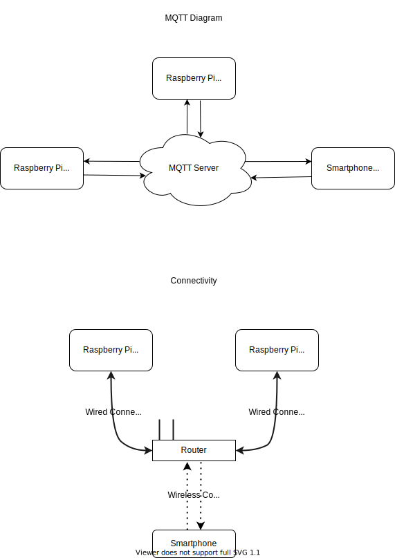
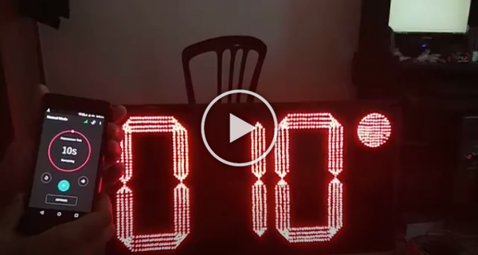
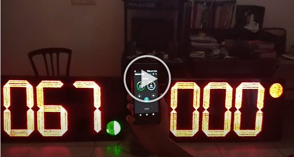

# ArcherClock

This is a timer system for archery competition developed by Quanfield Technologies. This repository contains the initial functionality demo and the main project codes and designs. 

There are two modes of the timer system: 
- Single Mode 
- Alternate mode

The main project uses `Raspberry Pi` as the controller of the segment. The display controller is custom-made The Schematic and PCB are designed with `Proteus Design Suite`.

 - <a href="https://github.com/farhanfuadabir/ArcherClock/tree/main/PCB%20Designs">PCB Design Files</a>
 - <a href="https://github.com/atick-faisal/Archer-Clock">Android App</a>

## Developer

Farhan Fuad Abir, Md. Ahasan Atick Faisal

## Schematic

## PCB Layout

## Android App Interface

### Normal Mode

 

### Alternate Mode 

 

### Settings

 

## System Diagrams

 

## Video Demostration

### Normal Mode

  

### Alternate Mode

  

## Project Reference

<a href="http://www.archeryclock.com/">Click Here</a>
